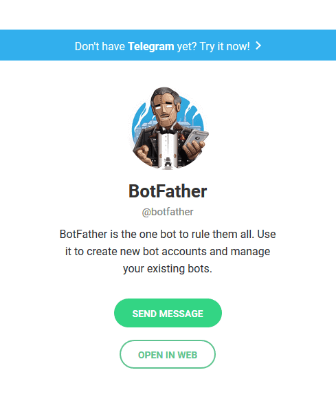
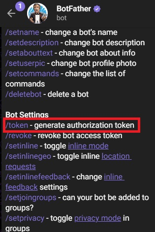
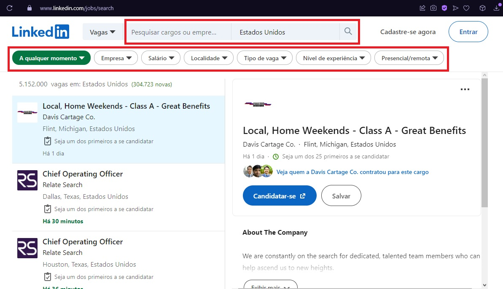
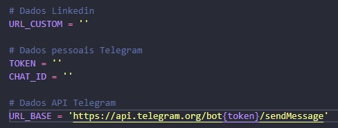

# **BOT SCRAPPING VAGAS LINKEDIN**  <h1> 

Este robô consiste em obter o código fonte de uma página de vagas do linkedin pré filtrada, realizar a raspagem dos dados no HTML, e enviar as informações encontradas para o Telegram através de sua API. <h2>

## **Instruções:** <h3>  

**PASSO 1:**
Realizar a criação de um canal de chat no Telegram utilizando o Bot Father. Para realizar a criação basta procurar por **BotFather** na barra de pesquisa do Telegram e seguir os passos informados no chat, é simples e intuitivo.

Após a criação, obter o Token e ID do chat criado. O Token é disponibilizado no própio BotFather através do comando **/token**:

Já o ChatID pode ser obtido acessando o link [https://api.telegram.org/botTOKEN/getUpdates] substituindo a palavra **TOKEN** pelo token gerado do seu canal. Em seguida, basta enviar qualquer mensagem no chat criado e atualizar a página. O id do chat aparece no json: {"message_id":xxx,"from":{"id":**Número ID**.

**PASSO 2:** Acessar o site do LinkedIn sem estar logado na sua conta [https://www.linkedin.com/jobs/search] e realizar os filtros desejados: 

Um link customizado será criado na url. Copiar o link e inserir no arquivo **config.py** no devido campo juntamente com o **Token** e **Chat ID**:

**OBS:** A URL base não deve ser alterada.

**PASSO 3:** Deve ser instalado na máquina o **Python 3.8** ou superior junto com as bibliotecas **httpx** e **parsel**.

Caso utilize o **Poetry**, basta utiliza o comando **poetry install** no seu terminal que todas as dependências serão instaladas automaticamente.

**PASSO 4:** Após a criação, instalação e configuração dos passos acima, basta executar o arquivo **main.py** e o robô irá iniciar a raspagem dos dados e enviará as informações encontradas devidamente formatadas para seu canal no Telegram.